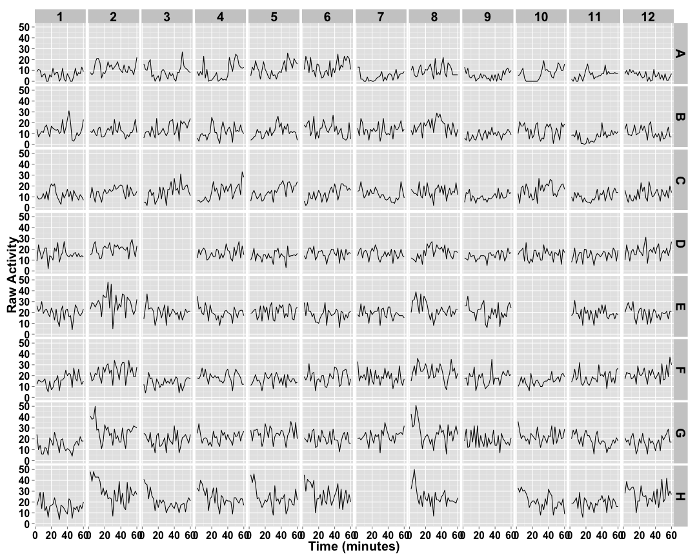
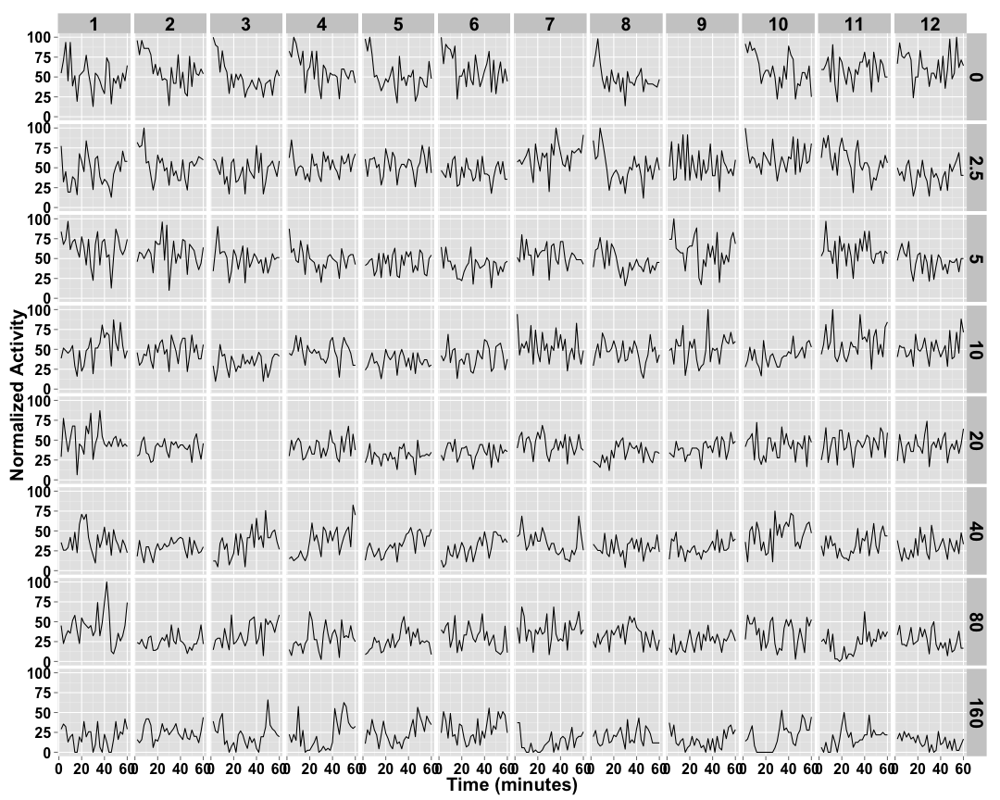
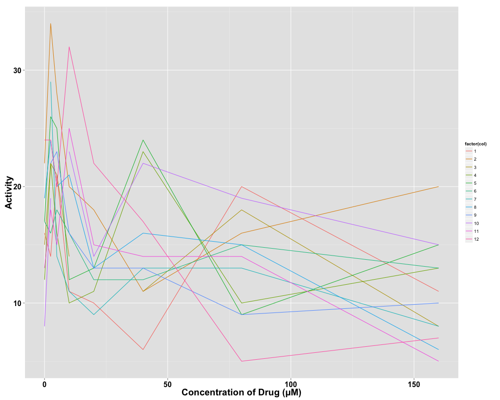
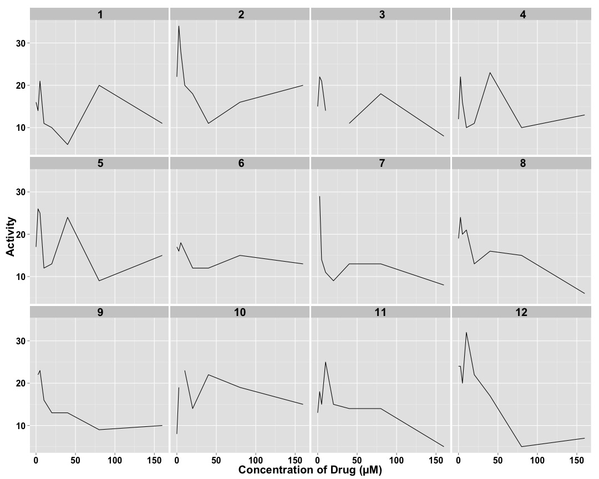
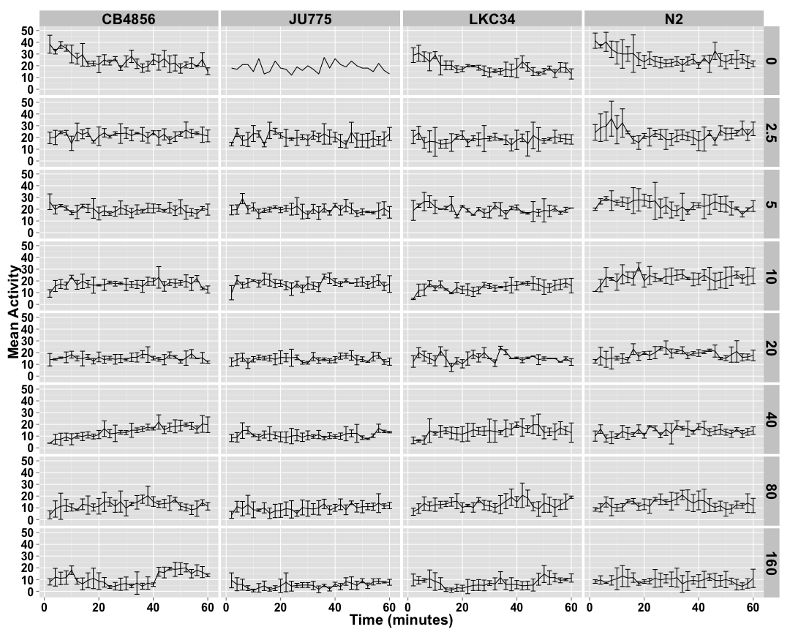
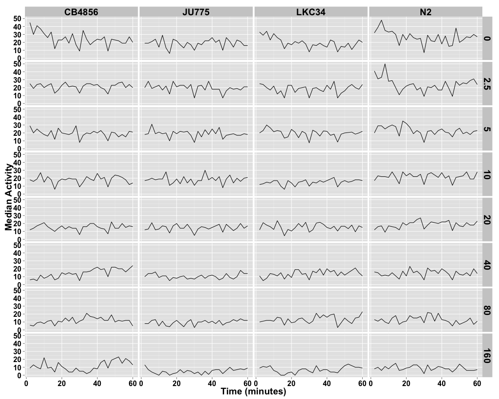
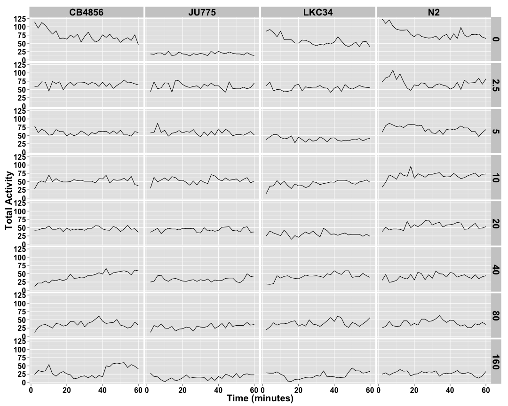
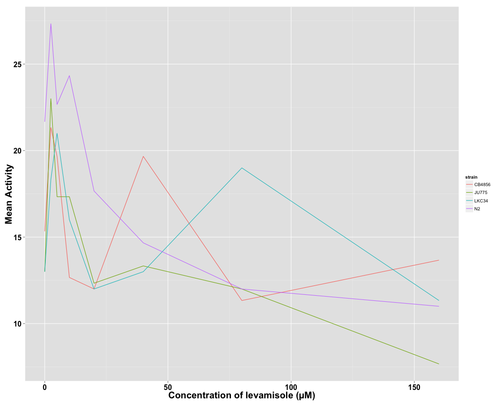

```
## [1] "p02_levamisole"
```


## Raw Activity ##

 

## Cleaned Data ##


 

## Well Normalized Data ##


 

## Well Variation in Drug Concentration ##

  


## Strain Mean Data ##

 

## Strain Median Data ##

 

## Strain Total Data ##

 

## Strain Normalized Data ##


 

## Strain Variation in Drug Concentration ##

 
