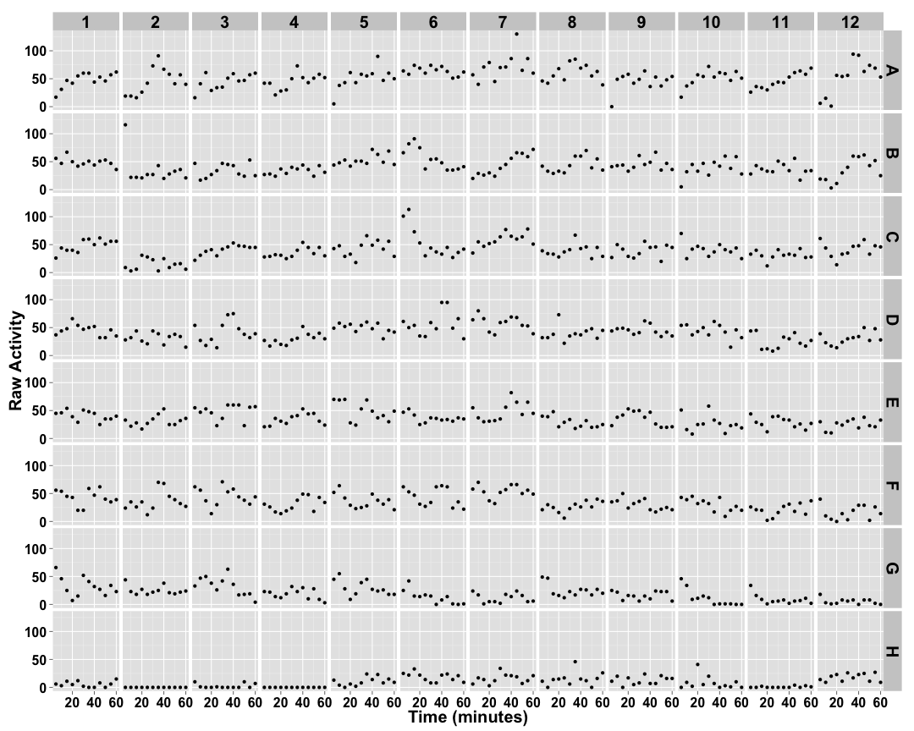
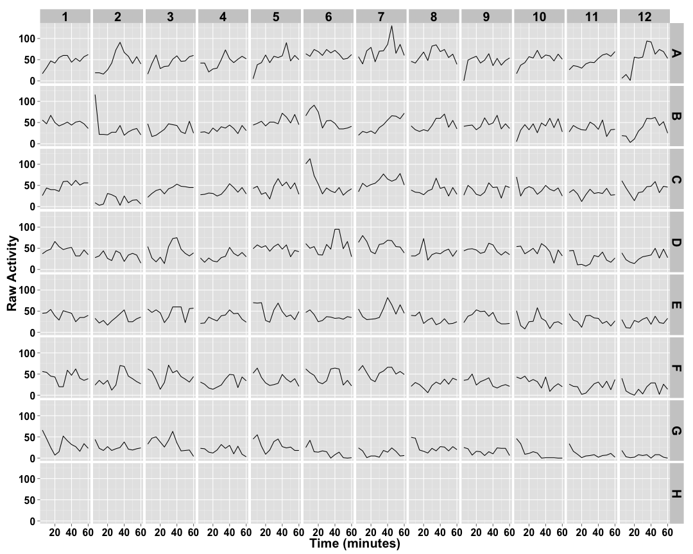
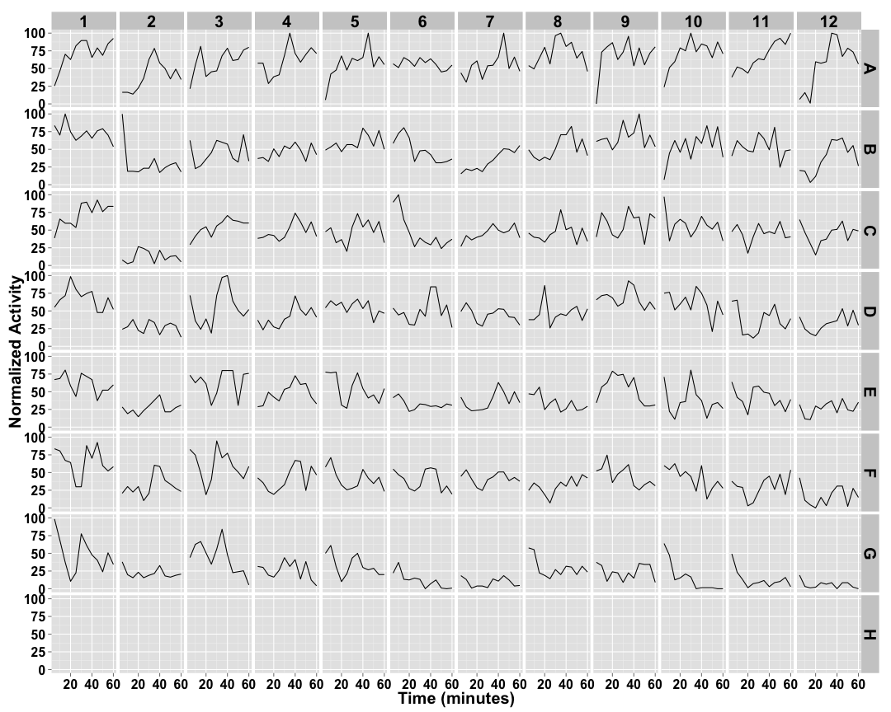
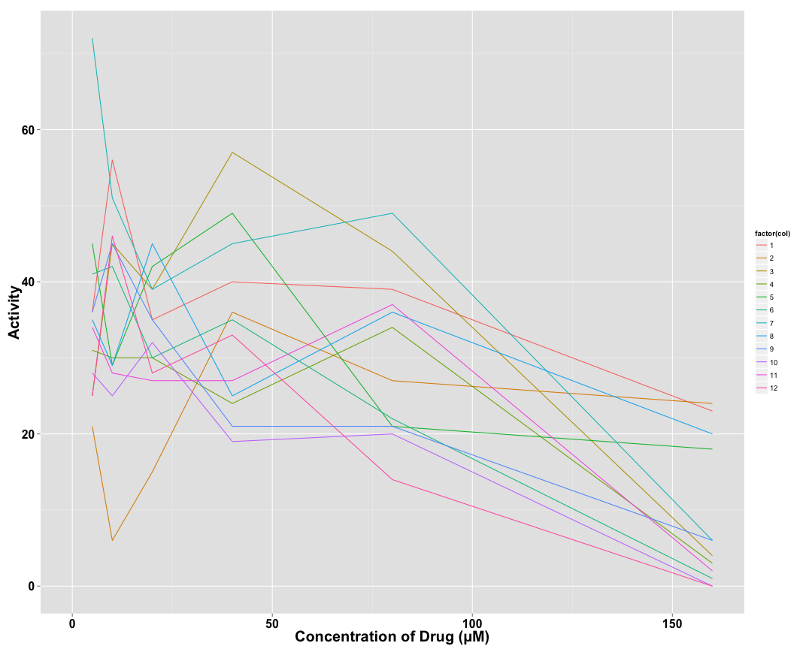
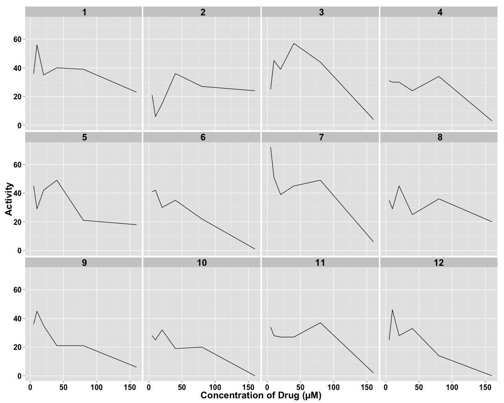

```
## [1] "p01_levamisole"
```


## Raw Activity ##

 

## Cleaned Data ##


 

## Well Normalized Data ##


 

## Well Variation in Drug Concentration ##

  


```
## [1] "No strain replicates to display."
```

## Strain Mean Data ##


## Strain Median Data ##


## Strain Total Data ##


## Strain Normalized Data ##


## Strain Variation in Drug Concentration ##


