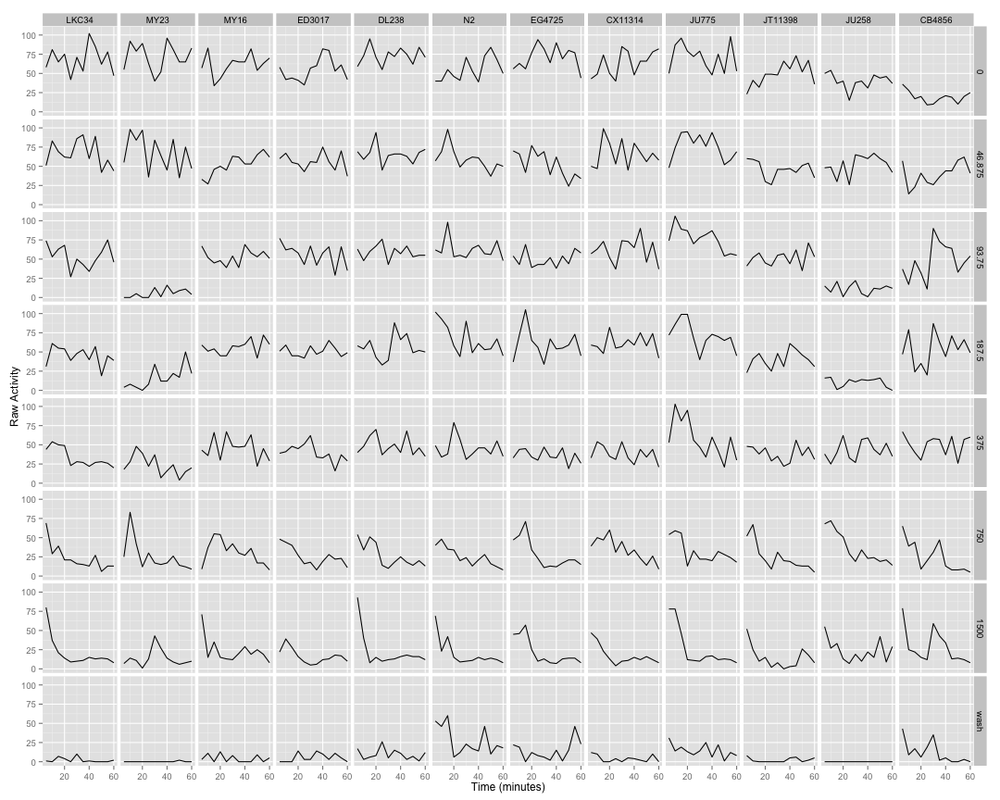
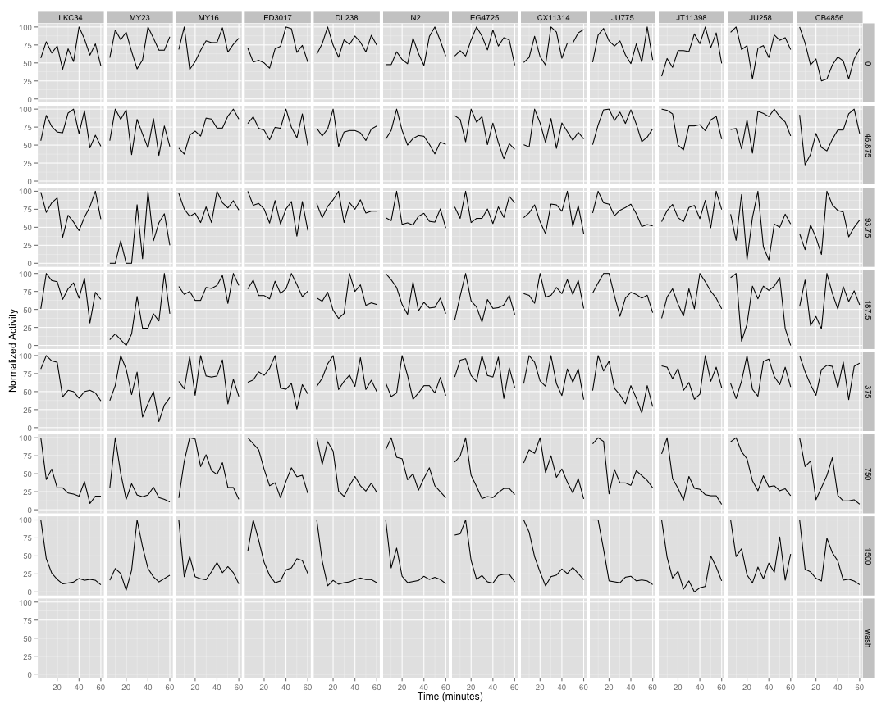
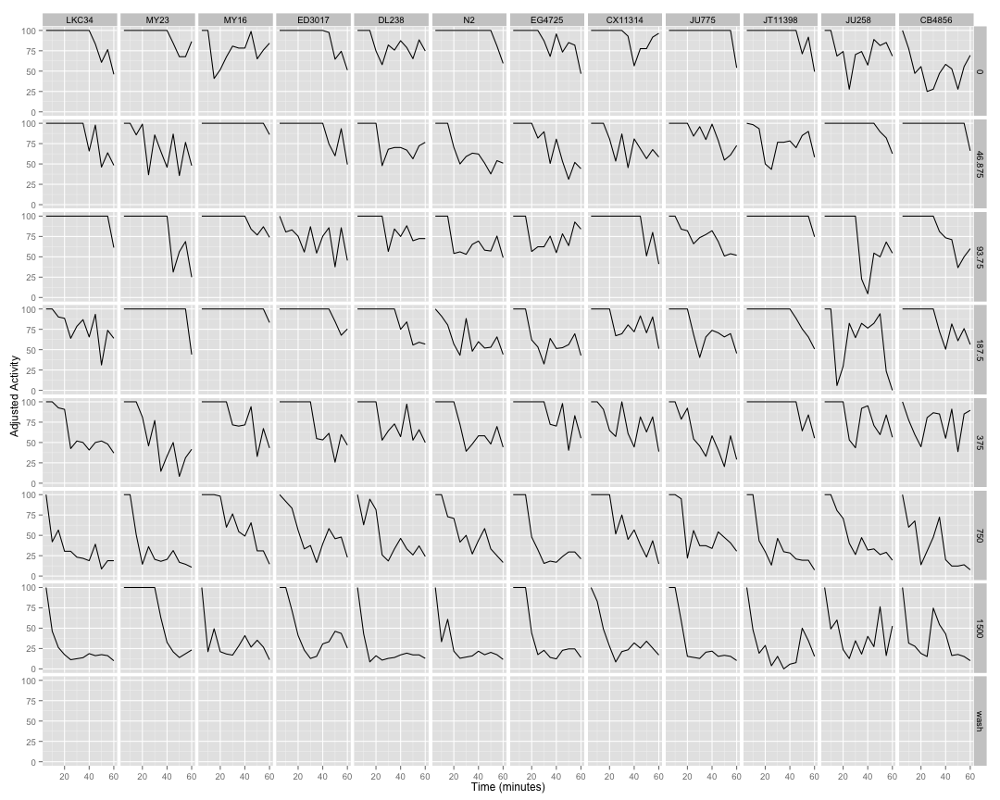
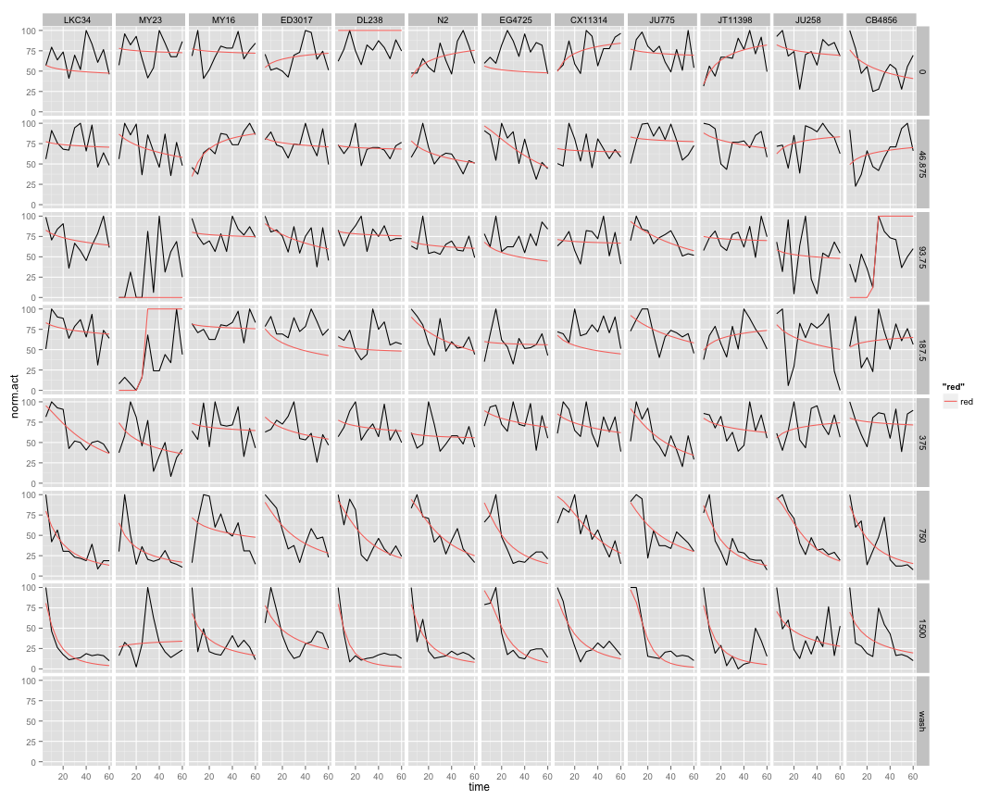

```
## [1] "p01_mebendazole"
```
 
## Raw Activity ##


 

## Cleaned Data ##


 

## Well Normalized Data ##


 

## Setting Top of Curve by Well ##


 

## Well Curve Fitting ##


```
##     strain row        bparam       cparam
## 1    LKC34   A    0.15617357 3.172212e+01
## 2    LKC34   B    0.14193220 2.895007e+04
## 3    LKC34   C    0.39295849 2.671459e+02
## 4    LKC34   D    0.31594969 7.638255e+02
## 5    LKC34   E    1.42707295 4.067701e+01
## 6    LKC34   F    1.30479855 1.425059e+01
## 7    LKC34   G    1.84920263 1.080985e+01
## 8    LKC34   H    0.00000000 0.000000e+00
## 9     MY23   A    0.11605844 2.717853e+05
## 10    MY23   B    0.61990865 1.016704e+02
## 11    MY23   C -457.71801110 2.303851e+02
## 12    MY23   D  -75.35390420 2.555626e+01
## 13    MY23   E    0.65442009 2.517176e+01
## 14    MY23   F    0.89072788 1.010258e+01
## 15    MY23   G   -0.13550948 7.966382e+03
## 16    MY23   H    0.00000000 0.000000e+00
## 17    MY16   A    0.11421761 2.344025e+05
## 18    MY16   B   -1.02456357 9.277543e+00
## 19    MY16   C    0.12649744 3.118198e+05
## 20    MY16   D    0.13462403 2.767991e+05
## 21    MY16   E    0.16723165 2.241182e+03
## 22    MY16   F    0.41178911 4.767721e+01
## 23    MY16   G    0.95635203 1.108010e+01
## 24    MY16   H    0.00000000 0.000000e+00
## 25  ED3017   A   -0.30656496 2.759088e+00
## 26  ED3017   B    0.23181883 2.885511e+03
## 27  ED3017   C    0.76309346 9.968593e+01
## 28  ED3017   D    0.57259569 3.603422e+01
## 29  ED3017   E    0.52319527 8.264003e+01
## 30  ED3017   F    1.29003410 2.893301e+01
## 31  ED3017   G    0.97044234 1.826627e+01
## 32  ED3017   H    0.00000000 0.000000e+00
## 33   DL238   A   18.15627890 4.655181e+03
## 34   DL238   B    0.08130996 7.763473e+05
## 35   DL238   C    0.13133248 3.415862e+05
## 36   DL238   D    0.10541395 3.085922e+01
## 37   DL238   E    0.26273334 5.464807e+02
## 38   DL238   F    1.52294816 2.596595e+01
## 39   DL238   G    2.04269611 9.759119e+00
## 40   DL238   H    0.00000000 0.000000e+00
## 41      N2   A   -0.57725832 8.469105e+00
## 42      N2   B    0.49723472 6.647291e+01
## 43      N2   C    0.15418782 9.324063e+02
## 44      N2   D    0.91628760 5.540742e+01
## 45      N2   E    0.08683712 9.030391e+02
## 46      N2   F    1.56340256 2.967286e+01
## 47      N2   G    1.51491533 1.212641e+01
## 48      N2   H    0.00000000 0.000000e+00
## 49  EG4725   A    0.13525033 3.194097e+01
## 50  EG4725   B    1.44235927 5.350267e+01
## 51  EG4725   C    0.39026859 3.468593e+01
## 52  EG4725   D    0.06528328 2.407688e+03
## 53  EG4725   E    0.52806141 2.661398e+02
## 54  EG4725   F    1.57335464 2.020911e+01
## 55  EG4725   G    2.31713163 2.043922e+01
## 56  EG4725   H    0.00000000 0.000000e+00
## 57 CX11314   A   -0.68338399 5.132879e+00
## 58 CX11314   B    0.07276833 2.685569e+05
## 59 CX11314   C    0.08355355 2.568189e+05
## 60 CX11314   D    0.38032041 3.458835e+01
## 61 CX11314   E    0.50660604 1.579199e+02
## 62 CX11314   F    1.91628522 3.665090e+01
## 63 CX11314   G    1.51097693 1.641358e+01
## 64 CX11314   H    0.00000000 0.000000e+00
## 65   JU775   A    0.15529801 1.199654e+04
## 66   JU775   B    0.14329683 3.334488e+05
## 67   JU775   C    0.95115501 8.202435e+01
## 68   JU775   D    0.85533703 8.873636e+01
## 69   JU775   E    1.22379424 3.518333e+01
## 70   JU775   F    1.24435178 3.046857e+01
## 71   JU775   G    2.98436349 1.655184e+01
## 72   JU775   H    0.00000000 0.000000e+00
## 73 JT11398   A   -0.87773369 1.062481e+01
## 74 JT11398   B    0.47758588 3.294384e+02
## 75 JT11398   C    0.10145109 2.528321e+05
## 76 JT11398   D   -0.42569354 5.344303e+00
## 77 JT11398   E    0.35070354 2.512995e+02
## 78 JT11398   F    1.53014208 1.716001e+01
## 79 JT11398   G    1.67280954 1.070036e+01
## 80 JT11398   H    0.00000000 0.000000e+00
## 81   JU258   A    0.28857442 1.020681e+03
## 82   JU258   B   -0.44470197 1.591127e+00
## 83   JU258   C    0.17223104 3.757023e+01
## 84   JU258   D    0.57199654 6.100995e+01
## 85   JU258   E   -0.33393951 2.528786e+00
## 86   JU258   F    1.91819974 2.749792e+01
## 87   JU258   G    0.73730018 1.639741e+01
## 88   JU258   H    0.00000000 0.000000e+00
## 89  CB4856   A    0.61651035 3.289122e+01
## 90  CB4856   B   -0.35588128 5.425152e+00
## 91  CB4856   C  -46.18662913 2.609006e+01
## 92  CB4856   D   -0.20102343 2.776256e+00
## 93  CB4856   E    0.18440472 8.958148e+03
## 94  CB4856   F    1.42140590 1.798849e+01
## 95  CB4856   G    0.90213885 1.254255e+01
## 96  CB4856   H    0.00000000 0.000000e+00
```

## 2 Parameter Logistic Function Fits by Well ##


 
